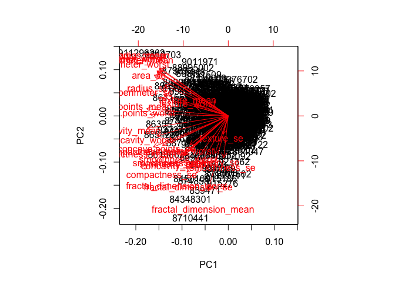
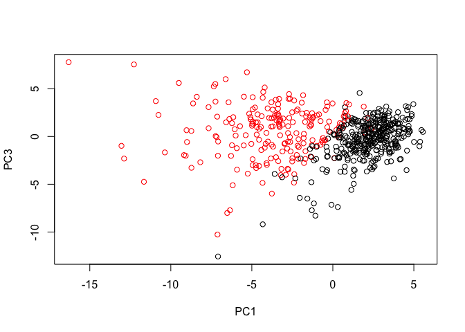
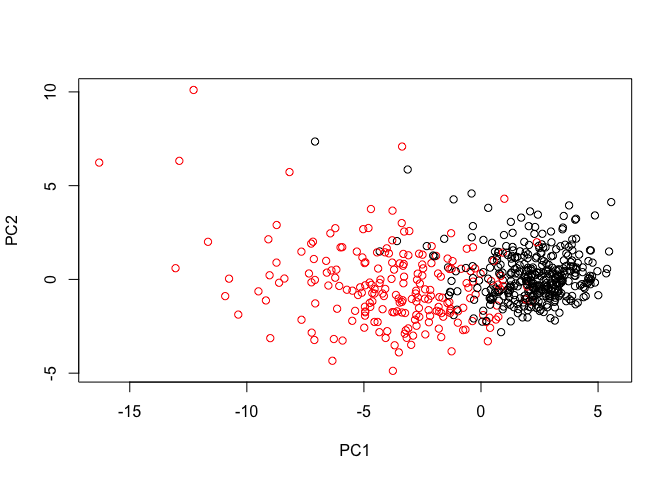

Class09
================
Jason Baer
10/30/2019

``` r
wisc.df <- read.csv("WisconsinCancer.csv")
```

Here we examine data from 569 patient samples.

``` r
x <- table(wisc.df$diagnosis)
x
```

    ## 
    ##   B   M 
    ## 357 212

In this data-set we have 212 cancer and 357 noncancer patients.

``` r
length(grep(pattern = "_mean", x = colnames(wisc.df)))
```

    ## [1] 10

``` r
class(wisc.df)
```

    ## [1] "data.frame"

``` r
wisc.data <- as.matrix(wisc.df[, 3:32])
```

``` r
row.names(wisc.data) <- wisc.df$id
```

``` r
diagnosis <- wisc.df$diagnosis
```

``` r
colMeans(wisc.data)
```

    ##             radius_mean            texture_mean          perimeter_mean 
    ##            1.412729e+01            1.928965e+01            9.196903e+01 
    ##               area_mean         smoothness_mean        compactness_mean 
    ##            6.548891e+02            9.636028e-02            1.043410e-01 
    ##          concavity_mean     concave.points_mean           symmetry_mean 
    ##            8.879932e-02            4.891915e-02            1.811619e-01 
    ##  fractal_dimension_mean               radius_se              texture_se 
    ##            6.279761e-02            4.051721e-01            1.216853e+00 
    ##            perimeter_se                 area_se           smoothness_se 
    ##            2.866059e+00            4.033708e+01            7.040979e-03 
    ##          compactness_se            concavity_se       concave.points_se 
    ##            2.547814e-02            3.189372e-02            1.179614e-02 
    ##             symmetry_se    fractal_dimension_se            radius_worst 
    ##            2.054230e-02            3.794904e-03            1.626919e+01 
    ##           texture_worst         perimeter_worst              area_worst 
    ##            2.567722e+01            1.072612e+02            8.805831e+02 
    ##        smoothness_worst       compactness_worst         concavity_worst 
    ##            1.323686e-01            2.542650e-01            2.721885e-01 
    ##    concave.points_worst          symmetry_worst fractal_dimension_worst 
    ##            1.146062e-01            2.900756e-01            8.394582e-02

``` r
apply(wisc.data,2,sd)
```

    ##             radius_mean            texture_mean          perimeter_mean 
    ##            3.524049e+00            4.301036e+00            2.429898e+01 
    ##               area_mean         smoothness_mean        compactness_mean 
    ##            3.519141e+02            1.406413e-02            5.281276e-02 
    ##          concavity_mean     concave.points_mean           symmetry_mean 
    ##            7.971981e-02            3.880284e-02            2.741428e-02 
    ##  fractal_dimension_mean               radius_se              texture_se 
    ##            7.060363e-03            2.773127e-01            5.516484e-01 
    ##            perimeter_se                 area_se           smoothness_se 
    ##            2.021855e+00            4.549101e+01            3.002518e-03 
    ##          compactness_se            concavity_se       concave.points_se 
    ##            1.790818e-02            3.018606e-02            6.170285e-03 
    ##             symmetry_se    fractal_dimension_se            radius_worst 
    ##            8.266372e-03            2.646071e-03            4.833242e+00 
    ##           texture_worst         perimeter_worst              area_worst 
    ##            6.146258e+00            3.360254e+01            5.693570e+02 
    ##        smoothness_worst       compactness_worst         concavity_worst 
    ##            2.283243e-02            1.573365e-01            2.086243e-01 
    ##    concave.points_worst          symmetry_worst fractal_dimension_worst 
    ##            6.573234e-02            6.186747e-02            1.806127e-02

``` r
round( apply(wisc.data, 2, sd), 3)
```

    ##             radius_mean            texture_mean          perimeter_mean 
    ##                   3.524                   4.301                  24.299 
    ##               area_mean         smoothness_mean        compactness_mean 
    ##                 351.914                   0.014                   0.053 
    ##          concavity_mean     concave.points_mean           symmetry_mean 
    ##                   0.080                   0.039                   0.027 
    ##  fractal_dimension_mean               radius_se              texture_se 
    ##                   0.007                   0.277                   0.552 
    ##            perimeter_se                 area_se           smoothness_se 
    ##                   2.022                  45.491                   0.003 
    ##          compactness_se            concavity_se       concave.points_se 
    ##                   0.018                   0.030                   0.006 
    ##             symmetry_se    fractal_dimension_se            radius_worst 
    ##                   0.008                   0.003                   4.833 
    ##           texture_worst         perimeter_worst              area_worst 
    ##                   6.146                  33.603                 569.357 
    ##        smoothness_worst       compactness_worst         concavity_worst 
    ##                   0.023                   0.157                   0.209 
    ##    concave.points_worst          symmetry_worst fractal_dimension_worst 
    ##                   0.066                   0.062                   0.018

``` r
#Perform PCA on wisc.data by completing the following code
wisc.pr <- prcomp (wisc.data, scale = TRUE)

summary(wisc.pr)
```

    ## Importance of components:
    ##                           PC1    PC2     PC3     PC4     PC5     PC6
    ## Standard deviation     3.6444 2.3857 1.67867 1.40735 1.28403 1.09880
    ## Proportion of Variance 0.4427 0.1897 0.09393 0.06602 0.05496 0.04025
    ## Cumulative Proportion  0.4427 0.6324 0.72636 0.79239 0.84734 0.88759
    ##                            PC7     PC8    PC9    PC10   PC11    PC12
    ## Standard deviation     0.82172 0.69037 0.6457 0.59219 0.5421 0.51104
    ## Proportion of Variance 0.02251 0.01589 0.0139 0.01169 0.0098 0.00871
    ## Cumulative Proportion  0.91010 0.92598 0.9399 0.95157 0.9614 0.97007
    ##                           PC13    PC14    PC15    PC16    PC17    PC18
    ## Standard deviation     0.49128 0.39624 0.30681 0.28260 0.24372 0.22939
    ## Proportion of Variance 0.00805 0.00523 0.00314 0.00266 0.00198 0.00175
    ## Cumulative Proportion  0.97812 0.98335 0.98649 0.98915 0.99113 0.99288
    ##                           PC19    PC20   PC21    PC22    PC23   PC24
    ## Standard deviation     0.22244 0.17652 0.1731 0.16565 0.15602 0.1344
    ## Proportion of Variance 0.00165 0.00104 0.0010 0.00091 0.00081 0.0006
    ## Cumulative Proportion  0.99453 0.99557 0.9966 0.99749 0.99830 0.9989
    ##                           PC25    PC26    PC27    PC28    PC29    PC30
    ## Standard deviation     0.12442 0.09043 0.08307 0.03987 0.02736 0.01153
    ## Proportion of Variance 0.00052 0.00027 0.00023 0.00005 0.00002 0.00000
    ## Cumulative Proportion  0.99942 0.99969 0.99992 0.99997 1.00000 1.00000

``` r
biplot(wisc.pr)
```



``` r
#produce a PCA plot with color for 1 and 2
plot(wisc.pr$x[,1], wisc.pr$x[,2], col = wisc.df$diagnosis, 
     xlab = "PC1", ylab = "PC3")
```



``` r
#produce a PCA plot with color for 1 and 3
plot(wisc.pr$x[,1], wisc.pr$x[,3], col = wisc.df$diagnosis, 
     xlab = "PC1", ylab = "PC2")
```



``` r
pr.var <- wisc.pr$sdev^2
head(pr.var)
```

    ## [1] 13.281608  5.691355  2.817949  1.980640  1.648731  1.207357

``` r
pve <- pr.var / (sum(pr.var))
head(pve)
```

    ## [1] 0.44272026 0.18971182 0.09393163 0.06602135 0.05495768 0.04024522

``` r
plot(pve, xlab = "Principal Component", ylab = "Proportion of Variance Explained", ylim = c(0,1), type = "o")
```


``` r
barplot(pve, ylab = "Precent of Variance Explained",
     names.arg= paste0("PC",1:length(pve)), las=2, axes = FALSE)
axis(2, at=pve, labels=round(pve,2)*100 )
```


``` r
library("factoextra")
fviz_eig(wisc.pr, addlabels = TRUE)
```

whatever
========

``` r
x <- summary(wisc.pr)
```

``` r
x$importance[,"PC1"]
```

    ##     Standard deviation Proportion of Variance  Cumulative Proportion 
    ##               3.644394               0.442720               0.442720

The first PC captures 44.272 of the original variance in the dataset

``` r
which(x$importance[3,] > 0.7)[1]
```

    ## PC3 
    ##   3

``` r
wisc.pr$rotation["radius_mean", 1]
```

    ## [1] -0.2189024

``` r
wisc.pr$rotation["smoothness_se", 1]
```

    ## [1] -0.01453145

``` r
sort( abs(wisc.pr$rotation[,1]), decreasing = TRUE )
```

    ##     concave.points_mean          concavity_mean    concave.points_worst 
    ##              0.26085376              0.25840048              0.25088597 
    ##        compactness_mean         perimeter_worst         concavity_worst 
    ##              0.23928535              0.23663968              0.22876753 
    ##            radius_worst          perimeter_mean              area_worst 
    ##              0.22799663              0.22753729              0.22487053 
    ##               area_mean             radius_mean            perimeter_se 
    ##              0.22099499              0.21890244              0.21132592 
    ##       compactness_worst               radius_se                 area_se 
    ##              0.21009588              0.20597878              0.20286964 
    ##       concave.points_se          compactness_se            concavity_se 
    ##              0.18341740              0.17039345              0.15358979 
    ##         smoothness_mean           symmetry_mean fractal_dimension_worst 
    ##              0.14258969              0.13816696              0.13178394 
    ##        smoothness_worst          symmetry_worst           texture_worst 
    ##              0.12795256              0.12290456              0.10446933 
    ##            texture_mean    fractal_dimension_se  fractal_dimension_mean 
    ##              0.10372458              0.10256832              0.06436335 
    ##             symmetry_se              texture_se           smoothness_se 
    ##              0.04249842              0.01742803              0.01453145

``` r
data.scaled <- scale(wisc.data)
```

``` r
data.dist <- dist(data.scaled)
head(data.dist)
```

    ## [1] 10.309426  6.771675 10.463467  8.663413  8.402233  9.843286

``` r
wisc.hclust <- hclust(dist(wisc.pr$x[,1:3]))
```
