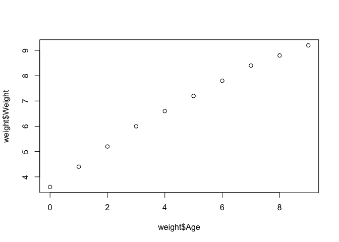

Data visualization class 05
================
jasonbaer
2019-11-01

``` r
# Class 5 Data visualization

weight <- read.table(file = 'bimm143_05_rstats/weight_chart.txt', header = TRUE)
plot(weight$Age, weight$Weight)
```



``` r
plot(type = 'l', weight$Age, weight$Weight)
```


``` r
plot(type = 'o', weight$Age, weight$Weight, lwd = 2, pch = 15, cex = 1.5, ylim = c(2,10), xlab = 'Age(months)', ylab = "weight(kg)", main = 'Baby Weight with Age')
```


``` r
#pch is to make it a square bullet, cex is for the thickness of the bullet, lwd is for the line thickness, ylim is y axis limits

mouse <- read.delim(file = "bimm143_05_rstats/feature_counts.txt", header = TRUE, sep = "\t")
par(mar=c(3.1, 11.1, 4.1, 2))
barplot(mouse$Count, horiz = TRUE, ylab = "", names.arg = mouse$Feature, main = "Number of features in the GRCm38 genome", las = 1, xlim = c(0,80000)) 
```


``` r
par(mar=c(3.1, 5.1, 4.1, 2))
x <- c(rnorm(1000), rnorm(1000) + 4)
hist(x, breaks = 80)
```


``` r
counts <- read.delim(file = "bimm143_05_rstats/male_female_counts.txt", header = TRUE, sep = "\t")
par(mar=c(6.1, 5.1, 4.1, 2))
barplot(counts$Count, col = rainbow(10), names.arg = counts$Sample, las = 2, xlab = "", ylab = "Counts", ylim = c(0, 20))
```


``` r
genes <- read.delim(file = "bimm143_05_rstats/up_down_expression.txt", header = TRUE, sep = "\t")
table(genes$State)
```

    ## 
    ##       down unchanging         up 
    ##         72       4997        127

``` r
palette(c("cyan", "grey", "blue"))
plot(genes$Condition1, genes$Condition2, col = genes$State, xlab = "Expression Condition 1", ylab = "Expression Condition 2")
```


``` r
meth <- read.delim(file = "bimm143_05_rstats/expression_methylation.txt", header = TRUE, sep = "\t")
inds <- meth$expression > 0
dcols.custom <- densCols(meth$gene.meth[inds], meth$expression[inds], colramp = colorRampPalette(c("cyan", 'green2', "blue", "gray")))
plot(meth$gene.meth[inds], meth$expression[inds], col = dcols.custom, pch = 20)
```


``` r
#put multiple plots in one window --> par(mfrow=(row, col))

par(mfrow=c(1,1))
```
