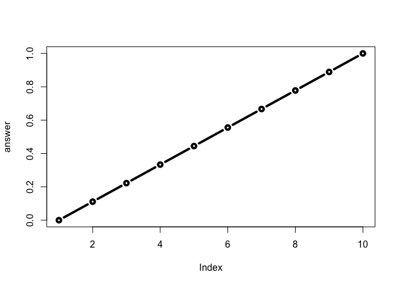

Class06
================
Jason Baer
10/18/2019

This is a H1
============

This is my class 6 work. This will be **bold**

A H2
----

### A level 3 heading H3

``` r
 test1r <- read.table("test1.txt", sep = ',', header = TRUE)
test1r
```

    ##   Col1 Col2 Col3
    ## 1    1    2    3
    ## 2    4    5    6
    ## 3    7    8    9
    ## 4    a    b    c

``` r
 test2r <- read.table('test2.txt', sep = '$', header = TRUE)
 test2r
```

    ##   Col1 Col2 Col3
    ## 1    1    2    3
    ## 2    4    5    6
    ## 3    7    8    9
    ## 4    a    b    c

``` r
 test3r <- read.table('test3.txt', sep = '', header = FALSE)
 test3r
```

    ##   V1 V2 V3
    ## 1  1  6  a
    ## 2  2  7  b
    ## 3  3  8  c
    ## 4  4  9  d
    ## 5  5 10  e

Our first silly function

``` r
add <- function(x, y=1) {
 # Sum the input x and y
 x + y
}
```

``` r
add(5,5)
```

    ## [1] 10

``` r
add(c(5,6))
```

    ## [1] 6 7

``` r
add( x = c(5,6,1,5,10), y = 100)
```

    ## [1] 105 106 101 105 110

``` r
add(c(5, 5, NA, 7))
```

    ## [1]  6  6 NA  8

This wont work, need to write a function to do this lots of times

then turn it into a function. you need a name, arguments and a body

``` r
rescale <- function(x) {
  rng <- range(x)
  (x - rng[1] / rng[2] - rng[1])
}
```

``` r
rescale(1:10)
```

    ##  [1] -0.1  0.9  1.9  2.9  3.9  4.9  5.9  6.9  7.9  8.9

``` r
rescale( c(1,2,NA,3,10) )
```

    ## [1] NA NA NA NA NA

``` r
x <- c(1, 2, NA, 4)
range(x)
```

    ## [1] NA NA

help(range)

``` r
rescale2 <- function(x) {
  rng <- range(x, na.rm = TRUE)
  (x - rng[1] / rng[2] - rng[1])
}
```

``` r
rescale2( c(1,2,NA,3,10) )
```

    ## [1] -0.1  0.9   NA  1.9  8.9

``` r
rescale3 <- function(x, na.rm=TRUE, plot=FALSE) {
 if(na.rm) {
 rng <-range(x, na.rm=na.rm)
 } else {
 rng <-range(x)
 }
 print("Hello")
 answer <- (x - rng[1]) / (rng[2] - rng[1])
 print("is it me you are looking for?")
 if(plot) {
 plot(answer, typ="b", lwd=4)
 }
 print("I can see it in ...")
}
```

``` r
rescale3(1:10, plot = TRUE)
```

    ## [1] "Hello"
    ## [1] "is it me you are looking for?"



    ## [1] "I can see it in ..."
